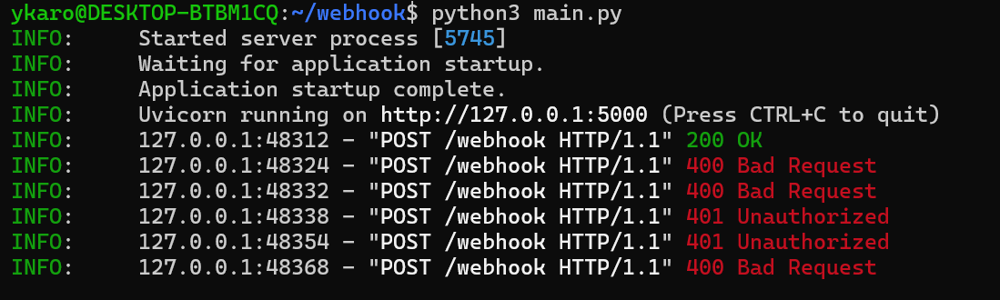
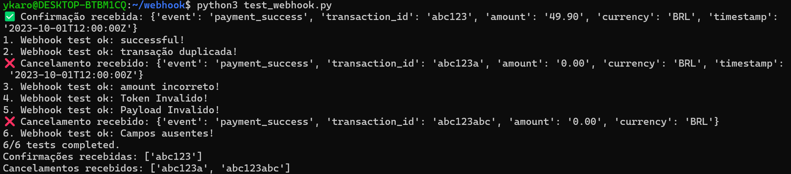
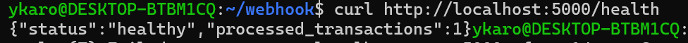

## Descrição do Projeto

Serviço de webhook para processamento de pagamentos usando paradigmas de **programação funcional**. O serviço recebe notificações de gateways de pagamento e processa as transações de forma segura e confiável.

## Arquitetura

O projeto foi desenvolvido seguindo os princípios da programação funcional:

- **Funções Puras**: Todas as funções de validação e processamento são puras, sem efeitos colaterais
- **Imutabilidade**: Estruturas de dados são tratadas como imutáveis
- **Composição**: Funcionalidades complexas são construídas através da composição de funções simples
- **Separação de Responsabilidades**: Lógica de negócio separada da infraestrutura HTTP

## Funcionalidades

- Recebe requisições POST no endpoint /webhook
- Valida autenticação através de token no header X-Webhook-Token
- Processa payload JSON com dados de pagamento
- Retorna status HTTP apropriados (200, 400, 401)
- **Verificação de Integridade**: Valida estrutura e conteúdo do payload
- **Mecanismo de Veracidade**: Autenticação via token secreto
- **Cancelamento de Transação**: Cancela transações inválidas ou divergentes
- **Confirmação de Transação**: Confirma transações válidas
- **Prevenção de Duplicação**: Controla transações já processadas
- **Endpoint de Saúde**: Monitora status do serviço

## Estrutura do Projeto

```
webhook-service/
├── main.py
├── README.md
├── requirements.txt
└── test_webhook.py     # Script de teste fornecido
└── images/
    ├── image1.png
    └── image2.png
```

### Regras de Negócio

- **Event**: Deve ser `payment_success`
- **Amount**: Entre 0.01 e 999999.99
- **Currency**: BRL, USD ou EUR
- **Transaction ID**: Não pode ser vazio
- **Duplicação**: Não aceita transações já processadas

## Fluxo de Processamento

1. **Recepção**: Webhook recebe requisição POST
2. **Autenticação**: Valida token de segurança
3. **Parsing**: Extrai e valida JSON do payload
4. **Validação**: Verifica estrutura e regras de negócio
5. **Processamento**:
   - ✅ **Transação Válida**: Confirma via `/confirmar`
   - ❌ **Transação Inválida**: Cancela via `/cancelar`
6. **Resposta**: Retorna status apropriado

## Segurança

- **Autenticação por Token**: Previne requisições não autorizadas
- **Validação de Input**: Sanitiza e valida todos os dados recebidos
- **Controle de Duplicação**: Previne processamento múltiplo da mesma transação
- **Tratamento de Erros**: Responses seguros sem exposição de informações internas

### Instalação

1. Clone o repositório:

```bash
git clone https://github.com/ykarodeandrade/programacao_funcional_projeto3.git
```

2. Instale as dependências:

```bash
pip install fastapi uvicorn requests
```

## Como Executar

### 1. Iniciar o Serviço

```bash
python3 main.py
```

O serviço estará disponível em: `http://localhost:5000`

### 2. Executar os Testes

Em outro terminal, execute o script de teste:

```bash
python3 test_webhook.py
```

### 3. Verificar Saúde do Serviço

```bash
curl http://localhost:5000/health
```

## API Reference

### POST /webhook

Endpoint principal para receber notificações de pagamento.

**Responses:**

- `200`: Transação processada com sucesso
- `400`: Dados inválidos ou transação duplicada
- `401`: Token de autenticação inválido
- `500`: Erro interno do servidor







>

- Ao executar python3 test_webhook.py, um conjunto automatizado de testes é disparado contra o servidor main.py. A saída gerada no terminal representa o log de execução e o resultado final dessas validações.

- A linha 6/6 tests completed confirma que o serviço atendeu a todos os requisitos funcionais avaliados, que incluem:Processamento de Sucesso: Aceitar uma transação válida, registrando a Confirmação recebida.

- Controle de Idempotência: Rejeitar uma transação com transaction_id já processado.Validação de Dados: Rejeitar transações com valores monetários inválidos ou campos obrigatórios ausentes, registrando o Cancelamento recebido.

- Segurança: Bloquear requisições com token de autenticação (X-Webhook-Token) inválido ou payload malformado.

- Confirmações recebidas e Cancelamentos recebidos demonstram que os callbacks para os sistemas externos foram acionados corretamente de acordo com a lógica de negócio de cada cenário.
